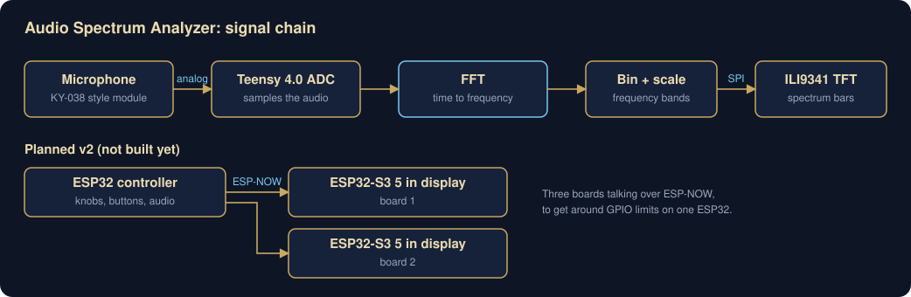

# Audio Spectrum Analyzer

A real-time audio visualizer. A microphone feeds a Teensy 4.0, which runs an FFT on the audio and draws the frequency spectrum as bars on a TFT display. Built with a friend.

**Status:** working.



## How it works

1. A **KY-038-style microphone module** outputs an analog audio signal.
2. The **Teensy 4.0** samples it with its ADC.
3. An **FFT** converts each block of samples from time to frequency.
4. The frequency bins get grouped into bands and scaled.
5. The bands are drawn as bars on an **ILI9341 TFT** over SPI.

I debugged the whole chain from the mic to the screen, which mostly meant figuring out where things went wrong in each step: bad samples, empty bins, or a display that wasn't redrawing fast enough.

## Hardware

| Part | What it does |
|---|---|
| Teensy 4.0 | Sampling, FFT, and display driving |
| KY-038-style mic module | Audio input |
| ILI9341 TFT display | Shows the spectrum, SPI |

## What's next

A bigger physical version is planned, with three displays, potentiometers, buttons, a servo metronome, and a speaker. One ESP32 doesn't have enough pins for all of that, so the plan is three boards talking over ESP-NOW: one ESP32 as the controller and two Waveshare ESP32-S3 5-inch display boards.

- [ ] Upload the Teensy code
- [ ] Add photos and a demo video
- [ ] Build the three-board ESP-NOW version

## Repo layout

```
firmware/   Teensy code (coming soon)
docs/       diagrams
media/      photos and video (coming soon)
```
